# ERP Quotation System - Architecture Diagrams

## C4 Model Architecture

This document provides a comprehensive view of the ERP Quotation system architecture using the C4 model (Context, Containers, Components, and Code).

---

## Level 1: System Context Diagram

```mermaid
graph TB
    %% External Users
    Customer[👤 Customer User<br/>Creates quotations<br/>Views orders]
    Sales[👤 Sales User<br/>Approves quotations<br/>Manages orders]
    Admin[👤 System Admin<br/>Monitors system<br/>Manages configuration]

    %% Main System
    ERP[🏢 ERP Quotation System<br/>Web-based quotation and<br/>order management platform]

    %% External Systems
    Database[(🗄️ Supabase PostgreSQL<br/>Database as a Service<br/>Stores all business data)]
    Email[📧 Email Service<br/>SMTP Provider<br/>Notifications & alerts]
    Analytics[📊 Analytics Service<br/>Usage tracking<br/>Performance monitoring]

    %% Relationships
    Customer -->|Creates quotations<br/>Views orders| ERP
    Sales -->|Manages quotations<br/>Updates order status| ERP
    Admin -->|System administration<br/>Configuration| ERP

    ERP -->|Stores/retrieves data<br/>HTTPS/SQL| Database
    ERP -->|Sends notifications<br/>SMTP| Email
    ERP -->|Sends metrics<br/>HTTPS| Analytics

    %% Styling
    classDef userClass fill:#e1f5fe,stroke:#01579b,stroke-width:2px
    classDef systemClass fill:#f3e5f5,stroke:#4a148c,stroke-width:3px
    classDef externalClass fill:#fff3e0,stroke:#e65100,stroke-width:2px

    class Customer,Sales,Admin userClass
    class ERP systemClass
    class Database,Email,Analytics externalClass
```



**System Purpose:**
The ERP Quotation System enables businesses to manage the complete quotation-to-order lifecycle, from initial customer requests through sales approval to order fulfillment.

**Key Interactions:**
- **Customers** create quotations and track their orders
- **Sales users** review, approve/reject quotations and manage order processing
- **System** automatically converts approved quotations to sales orders
- **Database** provides persistent storage with ACID transactions
- **External services** handle notifications and monitoring

---

## Level 2: Container Diagram

```mermaid
graph TB
    %% Users
    Users[👥 Users<br/>Customers & Sales]

    %% Frontend (Future)
    subgraph "Client Layer"
        WebApp[🌐 Web Application<br/>React/Vue/Angular<br/>Single Page Application<br/>Port: 3001]
        Mobile[📱 Mobile App<br/>React Native/Flutter<br/>Mobile interface<br/>iOS/Android]
    end

    %% Backend System
    subgraph "ERP Quotation System"
        API[🔧 REST API Server<br/>Node.js + Express<br/>JWT Authentication<br/>Port: 3000]
        
        subgraph "API Components"
            Auth[🔐 Authentication<br/>JWT tokens<br/>Role-based access]
            Quotations[📋 Quotation Engine<br/>Create, approve, convert<br/>Business logic]
            Orders[📦 Order Management<br/>Status tracking<br/>Fulfillment]
            Products[🏷️ Product Catalog<br/>Inventory tracking<br/>Pricing]
            Audit[📊 Audit Trail<br/>Change tracking<br/>Compliance]
        end
    end

    %% External Services
    subgraph "Data Layer"
        Database[(🗄️ Supabase PostgreSQL<br/>Primary data store<br/>ACID transactions<br/>Port: 5432)]
        Cache[⚡ Redis Cache<br/>Session storage<br/>Performance optimization<br/>Port: 6379]
    end

    subgraph "External Services"
        SMTP[📧 Email Service<br/>SendGrid/AWS SES<br/>Notifications]
        Monitoring[📊 Monitoring<br/>DataDog/New Relic<br/>Performance tracking]
        FileStorage[📁 File Storage<br/>AWS S3/CloudFlare<br/>Document attachments]
    end

    %% Relationships
    Users -->|HTTPS/JSON API<br/>Authentication| WebApp
    Users -->|HTTPS/JSON API<br/>Mobile interface| Mobile
    
    WebApp -->|REST API calls<br/>JWT authentication| API
    Mobile -->|REST API calls<br/>JWT authentication| API

    Auth -.->|Validates tokens<br/>Role checking| Quotations
    Auth -.->|Validates tokens<br/>Role checking| Orders
    Auth -.->|Validates tokens<br/>Role checking| Products

    Quotations -->|Creates orders<br/>Business rules| Orders
    Quotations -->|Logs changes<br/>Audit trail| Audit
    Orders -->|Logs changes<br/>Status updates| Audit

    API -->|SQL queries<br/>Transactions| Database
    API -->|Session data<br/>Caching| Cache
    API -->|Send notifications<br/>SMTP| SMTP
    API -->|Metrics & logs<br/>HTTP| Monitoring
    API -->|Upload/download<br/>File operations| FileStorage

    %% Styling
    classDef userClass fill:#e1f5fe,stroke:#01579b,stroke-width:2px
    classDef frontendClass fill:#e8f5e8,stroke:#2e7d32,stroke-width:2px
    classDef backendClass fill:#f3e5f5,stroke:#4a148c,stroke-width:3px
    classDef componentClass fill:#fff9c4,stroke:#f57f17,stroke-width:2px
    classDef dataClass fill:#ffebee,stroke:#c62828,stroke-width:2px
    classDef externalClass fill:#fff3e0,stroke:#e65100,stroke-width:2px

    class Users userClass
    class WebApp,Mobile frontendClass
    class API backendClass
    class Auth,Quotations,Orders,Products,Audit componentClass
    class Database,Cache dataClass
    class SMTP,Monitoring,FileStorage externalClass
```



**Container Responsibilities:**

### REST API Server (Node.js + Express)
- **Primary Interface**: Single entry point for all client applications
- **Authentication**: JWT-based authentication and authorization
- **Business Logic**: Core quotation and order management workflows
- **Data Validation**: Input validation and sanitization
- **API Documentation**: Swagger/OpenAPI documentation

### Database (Supabase PostgreSQL)
- **Data Persistence**: All business data storage
- **ACID Compliance**: Ensures data consistency
- **Relationships**: Complex relational data with foreign keys
- **Performance**: Optimized queries and indexing

### External Services
- **Email**: Automated notifications for status changes
- **Monitoring**: Application performance and error tracking
- **File Storage**: Document and attachment management

---

## Level 3: Component Diagram - API Server


**Component Responsibilities:**

### API Gateway Layer
- **Express Router**: Routes incoming requests to appropriate controllers
- **Middleware Stack**: Applies security, logging, and rate limiting
- **Swagger UI**: Provides interactive API documentation

### Security Layer
- **Auth Middleware**: Validates JWT tokens and user sessions
- **Role Authorization**: Enforces role-based access control
- **Input Validation**: Sanitizes and validates all input data

### Business Logic Layer
- **Controllers**: Handle HTTP requests and implement business rules
- **Workflow Management**: Manages quotation approval and order conversion
- **Business Rules**: Enforces pricing, discount, and approval policies

### Data Access Layer
- **Sequelize Models**: ORM layer for database interactions
- **Relationships**: Manages complex data relationships
- **Query Optimization**: Optimizes database queries for performance

---

## Level 4: Code Structure - Quotation Workflow

```mermaid
graph TB
    %% Request Entry Point
    Client[🌐 Client Request<br/>POST /api/quotations]

    %% Route Handler
    subgraph "Route Layer"
        Route[📍 quotations.js<br/>router.post('/')<br/>Middleware chain]
    end

    %% Middleware Chain
    subgraph "Middleware Chain"
        AuthToken[🔐 authenticateToken()<br/>JWT validation<br/>User extraction]
        AuthRole[👤 authorizeRole(CUSTOMER)<br/>Role verification<br/>Permission check]
        ValidateInput[✅ validateQuotation()<br/>express-validator<br/>Schema validation]
    end

    %% Controller Logic
    subgraph "Controller Layer"
        CreateQuotation[📋 createQuotation()<br/>Business logic<br/>Transaction management]
        
        subgraph "Business Operations"
            ValidateProducts[🏷️ Product Validation<br/>Check existence<br/>Verify active status]
            CalculateTotals[🧮 Calculate Totals<br/>Apply discounts<br/>Sum line items]
            CreateRecord[💾 Create Records<br/>Quotation + Items<br/>Database transaction]
            AuditLog[📊 Audit Logging<br/>Record creation<br/>Track changes]
        end
    end

    %% Model Layer
    subgraph "Model Layer"
        QuotationModel[📋 Quotation.create()<br/>Sequelize ORM<br/>Database insert]
        ItemModel[📄 QuotationItem.create()<br/>Line item creation<br/>Bulk insert]
        AuditModel[📊 AuditTrail.create()<br/>Change tracking<br/>Compliance log]
        ProductModel[🏷️ Product.findByPk()<br/>Product lookup<br/>Validation]
    end

    %% Database Operations
    subgraph "Database Layer"
        Transaction[⚡ Database Transaction<br/>BEGIN...COMMIT<br/>Atomicity guarantee]
        PostgreSQL[(🗄️ PostgreSQL<br/>Data persistence<br/>Referential integrity)]
    end

    %% Response Flow
    subgraph "Response Layer"
        FormatResponse[📤 Response Formatting<br/>Include relationships<br/>JSON serialization]
        SendResponse[📡 HTTP Response<br/>201 Created<br/>Quotation data]
    end

    %% Error Handling
    subgraph "Error Handling"
        ErrorCatch[❌ Error Handling<br/>Rollback transaction<br/>Log error]
        ErrorResponse[📤 Error Response<br/>400/500 status<br/>Error details]
    end

    %% Flow connections
    Client --> Route
    Route --> AuthToken
    AuthToken --> AuthRole
    AuthRole --> ValidateInput
    ValidateInput --> CreateQuotation

    CreateQuotation --> ValidateProducts
    ValidateProducts --> CalculateTotals
    CalculateTotals --> CreateRecord
    CreateRecord --> AuditLog

    ValidateProducts --> ProductModel
    CreateRecord --> Transaction
    Transaction --> QuotationModel
    Transaction --> ItemModel
    AuditLog --> AuditModel

    QuotationModel --> PostgreSQL
    ItemModel --> PostgreSQL
    AuditModel --> PostgreSQL
    ProductModel --> PostgreSQL

    AuditLog --> FormatResponse
    FormatResponse --> SendResponse

    %% Error flows
    AuthToken -.->|Auth Error| ErrorCatch
    ValidateProducts -.->|Validation Error| ErrorCatch
    CreateRecord -.->|DB Error| ErrorCatch
    ErrorCatch --> ErrorResponse

    %% Styling
    classDef clientClass fill:#e1f5fe,stroke:#01579b,stroke-width:2px
    classDef routeClass fill:#e8f5e8,stroke:#2e7d32,stroke-width:2px
    classDef middlewareClass fill:#fff3e0,stroke:#e65100,stroke-width:2px
    classDef controllerClass fill:#f3e5f5,stroke:#4a148c,stroke-width:3px
    classDef businessClass fill:#fff9c4,stroke:#f57f17,stroke-width:2px
    classDef modelClass fill:#ffebee,stroke:#c62828,stroke-width:2px
    classDef dbClass fill:#fce4ec,stroke:#880e4f,stroke-width:3px
    classDef responseClass fill:#f1f8e9,stroke:#33691e,stroke-width:2px
    classDef errorClass fill:#ffebee,stroke:#d32f2f,stroke-width:2px

    class Client clientClass
    class Route routeClass
    class AuthToken,AuthRole,ValidateInput middlewareClass
    class CreateQuotation controllerClass
    class ValidateProducts,CalculateTotals,CreateRecord,AuditLog businessClass
    class QuotationModel,ItemModel,AuditModel,ProductModel modelClass
    class Transaction,PostgreSQL dbClass
    class FormatResponse,SendResponse responseClass
    class ErrorCatch,ErrorResponse errorClass
```

**Code Structure Details:**

### Request Processing Flow
1. **Route Matching**: Express router maps URL to handler
2. **Authentication**: JWT token validation and user extraction
3. **Authorization**: Role-based access control verification
4. **Validation**: Input schema validation and sanitization
5. **Business Logic**: Core quotation creation workflow
6. **Database Operations**: Transactional data persistence
7. **Response**: Formatted JSON response with created data

### Error Handling Strategy
- **Middleware Errors**: Authentication and validation failures
- **Business Logic Errors**: Product validation and calculation errors
- **Database Errors**: Transaction rollback and constraint violations
- **Global Handler**: Centralized error formatting and logging

---

## Database Schema Diagram


**Schema Design Principles:**

### Data Integrity
- **Primary Keys**: UUID v4 for all entities
- **Foreign Keys**: Enforced referential integrity
- **Unique Constraints**: Email, SKU, quotation/order numbers
- **Check Constraints**: Positive quantities and prices

### Audit Trail
- **Complete Tracking**: All quotation changes logged
- **User Attribution**: Who made what changes when
- **Reason Tracking**: Business justification for changes
- **Metadata Storage**: Additional context in JSON format

### Performance Optimization
- **Indexes**: Strategic indexing on foreign keys and search fields
- **Partitioning**: Date-based partitioning for audit trails
- **Query Optimization**: Efficient joins and aggregations

---

## Deployment Architecture

```mermaid
graph TB
    %% Load Balancer / CDN
    subgraph "Edge Layer"
        CDN[🌐 CloudFlare CDN<br/>Static assets<br/>DDoS protection]
        LB[⚖️ Load Balancer<br/>NGINX/ALB<br/>SSL termination]
    end

    %% Application Layer
    subgraph "Application Layer"
        subgraph "Production Environment"
            API1[🔧 API Server 1<br/>Node.js + Express<br/>Docker container]
            API2[🔧 API Server 2<br/>Node.js + Express<br/>Docker container]
            API3[🔧 API Server 3<br/>Node.js + Express<br/>Docker container]
        end

        subgraph "Staging Environment"
            StageAPI[🔧 Staging API<br/>Testing environment<br/>Docker container]
        end
    end

    %% Data Layer
    subgraph "Data Layer"
        subgraph "Primary Database"
            PrimaryDB[(🗄️ Supabase PostgreSQL<br/>Primary database<br/>Read/Write operations)]
        end

        subgraph "Caching Layer"
            Redis[(⚡ Redis Cluster<br/>Session storage<br/>Application cache)]
        end

        subgraph "File Storage"
            S3[📁 AWS S3<br/>Document storage<br/>Backup files]
        end
    end

    %% External Services
    subgraph "External Services"
        Monitoring[📊 DataDog/New Relic<br/>Application monitoring<br/>Performance metrics]
        Logging[📝 ELK Stack<br/>Centralized logging<br/>Error tracking]
        Email[📧 SendGrid<br/>Email notifications<br/>Transactional emails]
    end

    %% CI/CD Pipeline
    subgraph "CI/CD Pipeline"
        GitHub[📦 GitHub Repository<br/>Source code<br/>Version control]
        Actions[🔄 GitHub Actions<br/>Automated testing<br/>Deployment pipeline]
        Registry[📦 Docker Registry<br/>Container images<br/>Version management]
    end

    %% Request Flow
    Users[👥 Users] --> CDN
    CDN --> LB
    LB --> API1
    LB --> API2
    LB --> API3

    %% Data Connections
    API1 --> PrimaryDB
    API2 --> PrimaryDB
    API3 --> PrimaryDB
    StageAPI --> PrimaryDB

    API1 --> Redis
    API2 --> Redis
    API3 --> Redis

    API1 --> S3
    API2 --> S3
    API3 --> S3

    %% External Service Connections
    API1 --> Monitoring
    API2 --> Monitoring
    API3 --> Monitoring
    StageAPI --> Monitoring

    API1 --> Email
    API2 --> Email
    API3 --> Email

    %% CI/CD Flow
    GitHub --> Actions
    Actions --> Registry
    Registry --> API1
    Registry --> API2
    Registry --> API3
    Registry --> StageAPI

    %% Monitoring Connections
    PrimaryDB -.-> Monitoring
    Redis -.-> Monitoring
    LB -.-> Logging
    API1 -.-> Logging
    API2 -.-> Logging
    API3 -.-> Logging

    %% Styling
    classDef userClass fill:#e1f5fe,stroke:#01579b,stroke-width:2px
    classDef edgeClass fill:#e8f5e8,stroke:#2e7d32,stroke-width:2px
    classDef appClass fill:#f3e5f5,stroke:#4a148c,stroke-width:3px
    classDef dataClass fill:#ffebee,stroke:#c62828,stroke-width:2px
    classDef externalClass fill:#fff3e0,stroke:#e65100,stroke-width:2px
    classDef cicdClass fill:#f1f8e9,stroke:#33691e,stroke-width:2px

    class Users userClass
    class CDN,LB edgeClass
    class API1,API2,API3,StageAPI appClass
    class PrimaryDB,Redis,S3 dataClass
    class Monitoring,Logging,Email externalClass
    class GitHub,Actions,Registry cicdClass
```



**Deployment Characteristics:**

### High Availability
- **Multiple API Instances**: Load-balanced application servers
- **Database Redundancy**: Supabase managed high availability
- **Automatic Failover**: Health checks and failover mechanisms

### Scalability
- **Horizontal Scaling**: Additional API server instances
- **Database Scaling**: Supabase automatic scaling
- **Caching Strategy**: Redis for performance optimization

### Security
- **SSL/TLS**: End-to-end encryption
- **Network Security**: VPC and security groups
- **Authentication**: JWT with secure key management
- **Rate Limiting**: Protection against abuse

### Monitoring & Observability
- **Application Monitoring**: Performance and error tracking
- **Infrastructure Monitoring**: Server and database metrics
- **Centralized Logging**: Aggregated log analysis
- **Alerting**: Proactive issue notification

---

## Technology Stack Summary

### Backend Technologies
- **Runtime**: Node.js v18 LTS
- **Framework**: Express.js v4.19.2
- **Database**: PostgreSQL (Supabase)
- **ORM**: Sequelize v6.37.3
- **Authentication**: JWT (jsonwebtoken)
- **Validation**: express-validator
- **Documentation**: Swagger/OpenAPI 3.0 (Interactive UI)
- **Testing**: Jest + Supertest (70% coverage)

### API Features
- **Authentication**: Complete JWT-based auth with role management
- **Products**: Full catalog management with search and filtering
- **Quotations**: Complete lifecycle from creation to approval
- **Sales Orders**: Automated generation and status management
- **Audit Trail**: Full change tracking and compliance logging
- **Interactive Documentation**: Swagger UI at `/api-docs`

### Infrastructure & DevOps
- **Containerization**: Docker + Docker Compose
- **Database**: Supabase (managed PostgreSQL)
- **Caching**: Redis (optional)
- **File Storage**: AWS S3 or similar
- **Monitoring**: DataDog/New Relic
- **CI/CD**: GitHub Actions
- **Load Balancing**: NGINX/ALB

### Security & Compliance
- **Authentication**: JWT Bearer tokens
- **Authorization**: Role-based access control
- **Input Validation**: Comprehensive schema validation
- **SQL Injection**: Sequelize ORM protection
- **Rate Limiting**: express-rate-limit
- **Security Headers**: Helmet.js
- **Audit Trail**: Complete change tracking

This architecture provides a solid foundation for a scalable, maintainable, and secure ERP quotation management system.